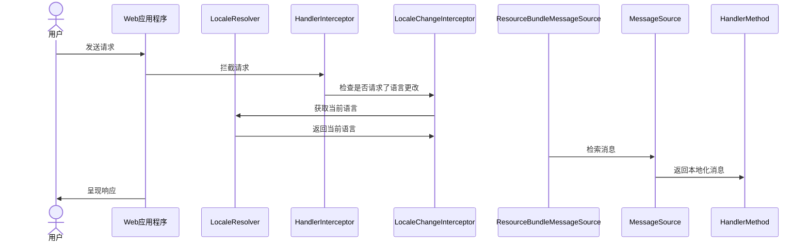

# 国际化

Spring Boot的web starter中已经涵盖了所需的基础组件，所以使用Spring Boot的web项目无需另加依赖。

## 快速实践

- 创建语言包项目的**源文件**目录增加语言包。

  目录结构如下：

  ```
  --\resources
  
  	--\i18n
  
  		--messages.properties
  
  		--messages_en_US.properties
  ```

- 设置Spring Boot配置文件`application.yml`

  ```yaml
  spring:  
    messages:
    	#设置语言包路径，具体路径由自己设置的语言包决定
      basename: i18n/messages
      encoding: UTF-8
      #设置是否使用系统语言，设置为false时默认走messages.properties
      fallback-to-system-locale: false
  ```
  
- 配置LocaleChangeInterceptor拦截器

  ```java
  @Configuration
  public class MyWebConfigure implements WebMvcConfigurer {
      /**
       * 配置拦截器
       */
      @Override
      public void addInterceptors(InterceptorRegistry registry) {
          LocaleChangeInterceptor interceptor = new LocaleChangeInterceptor();
        	// 修改语言的字段名
          interceptor.setParamName("language");
          // 生效的请求方法类型
          interceptor.setHttpMethods("GET", "POST", "PUT", "DELETE");
      }
  }
  ```

- 配置`LocaleResolver`解析器

  ```java
      /**
       * Locale解析器
       */
      @Bean
      public LocaleResolver localeResolver() {
          SessionLocaleResolver slr = new SessionLocaleResolver();
          slr.setDefaultLocale(Locale.US);
          return slr;
      }
  ```

- 获取Message

  ```java
  @Service
  public class MyService {
    // Spring的MessageSource接口可以根据Locale获取Message；ApplicationContext实现了这个接口
    private MessageSource messageSource;
    
  	public MyService(MessageSource messageSource) {
      this.messageSource = messageSource;
  	}
    
    /**
    * 测试获取Message，实际使用时可以封装到工具类中，方便调用
    */
  	public String getMessageI18N(String code, Object...args){
      // LocaleContextHolder中保存有当前线程的Locale
      Locale locale = LocaleContextHolder.getLocale();
      return messageSource.getMessage(code, args, locale);
    }
  }
  ```

## 语言包

在项目的源文件目录增加语言包目录，一般设置为`i18n/messages.properties`。增加语言时需要增加`messages_NewLanguage.properties`。

IDEA中可以将所有语言配置文件设置为一个资源包，这样编辑时可以同时修改，防止漏编辑。需要安装插件`Resource Bundle Editor`

IDEA中设置完资源包后路径如下：


编辑时打开任意一个`.properties`文件，就可以选择编辑资源包，此时右侧会显示出当前条目在所有语言包中的设置：


## LocaleChangeInterceptor拦截器

`LocaleChangeInterceptor`拦截器是Spring拦截器`HandlerInterceptor`的一个实现，用来实现请求处理前根据接口参数修改语言环境，设置Locale解析器`LocaleResolver`。`HandlerInterceptor`的核心源码如下，核心功能是对Locale解析器`LocaleResolver`设置`Locale`：

```java
public class LocaleChangeInterceptor implements HandlerInterceptor {
  //省略部分
  
  @Override
	public boolean preHandle(HttpServletRequest request, HttpServletResponse response, Object handler)
			throws ServletException {

		String newLocale = request.getParameter(getParamName());
		if (newLocale != null) {
			if (checkHttpMethod(request.getMethod())) {
				LocaleResolver localeResolver = RequestContextUtils.getLocaleResolver(request);
				if (localeResolver == null) {
					throw new IllegalStateException(
							"No LocaleResolver found: not in a DispatcherServlet request?");
				}
				try {
					localeResolver.setLocale(request, response, parseLocaleValue(newLocale));
				}
				catch (IllegalArgumentException ex) {
					if (isIgnoreInvalidLocale()) {
						if (logger.isDebugEnabled()) {
							logger.debug("Ignoring invalid locale value [" + newLocale + "]: " + ex.getMessage());
						}
					}
					else {
						throw ex;
					}
				}
			}
		}
		// Proceed in any case.
		return true;
	}
  
  //省略部分
}
```


## `LocaleResolver`解析器

`LocaleResolver`解析器用来保存Locale，实现方式可以选择`Cookie`或`Session`。使用时只需要将对应的Bean给到Spring容器即可。

以`Cookie`为例，`CookieLocaleResolver`实现了`LocaleContextResolver`接口提供了设置Locale的方法如下：

```java
@Override
	public void setLocale(HttpServletRequest request, @Nullable HttpServletResponse response, @Nullable Locale locale) {
		setLocaleContext(request, response, (locale != null ? new SimpleLocaleContext(locale) : null));
	}

	@Override
	public void setLocaleContext(HttpServletRequest request, @Nullable HttpServletResponse response,
			@Nullable LocaleContext localeContext) {

		Assert.notNull(response, "HttpServletResponse is required for CookieLocaleResolver");

		Locale locale = null;
		TimeZone timeZone = null;
		if (localeContext != null) {
			locale = localeContext.getLocale();
			if (localeContext instanceof TimeZoneAwareLocaleContext) {
				timeZone = ((TimeZoneAwareLocaleContext) localeContext).getTimeZone();
			}
			addCookie(response,
					(locale != null ? toLocaleValue(locale) : "-") + (timeZone != null ? '/' + timeZone.getID() : ""));
		}
		else {
			removeCookie(response);
		}
		request.setAttribute(LOCALE_REQUEST_ATTRIBUTE_NAME,
				(locale != null ? locale : determineDefaultLocale(request)));
		request.setAttribute(TIME_ZONE_REQUEST_ATTRIBUTE_NAME,
				(timeZone != null ? timeZone : determineDefaultTimeZone(request)));
	}
```

从源码中可以看到，是将Locale存放到了Cookie中，使用时从Cookie中获取。Session实现方式相同，只不过是存放到了Session中。

## 流程




