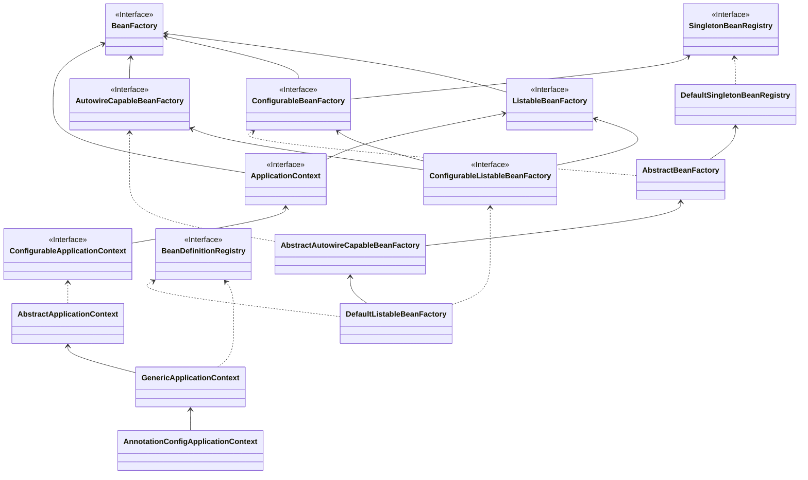

# Spring Framework源码

spring的循环依赖---属性注入---自动注入

spring bean 的生命周期---大概

spring bean 实例化的大概过程---大概

spring循环依赖---重点

spring当中的循环依赖怎么解决

- spring默认单例支持循环
- 怎么证明默认支持？怎么关闭
- spring解决循环依赖的细节---源码

依赖注入的功能---在初始化时完成

spring bean 在哪一步完成的依赖注入

Spring BeanDefintition创建过程

1. scan
2. parse
3. 调用扩展
4. 遍历map validate
5. new

